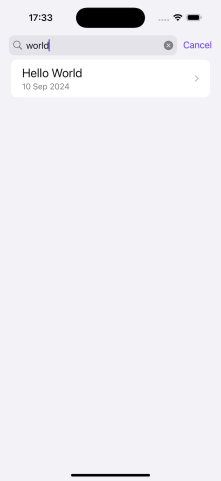

# Chronicle

**Chronicle** is a journaling app designed to help users reflect on their daily experiences, track their moods, and make meaningful entries about their day. With a focus on simplicity and clean design, **Chronicle** allows users to create, view, edit, and delete journal entries, rate their days, and categorize experiences for easy reference.

## Features

- **Create journal entries:** Write about your day, mood, and experiences.
- **Day rating system:** Rate your day on a scale of 1 to 3 stars:
  - **1 star:** A bad day.
  - **2 stars:** An average day.
  - **3 stars:** A great day.
- **Search functionality:** Quickly find journal entries by title or content using the built-in search feature.
- **Edit entries:** Update existing journal entries at any time.
- **Delete entries:** Remove unwanted entries with a single tap (action is permanent).
- **View entry details:** See journal entries in detail with your rating and notes.
- **Custom toolbar:** Consistent white toolbar and title text in entry views.
- **Information icon:** Tap the “i” symbol in the top left of the app to access more information about the app.
- **Light and dark mode support:** The app adapts seamlessly to both light and dark modes, ensuring a pleasant experience in any environment.

## Installation

1. Clone the repository:
   ```bash
   git clone https://github.com/your-username/Chronicle.git

## Screenshots





